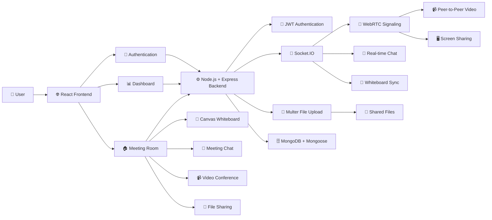
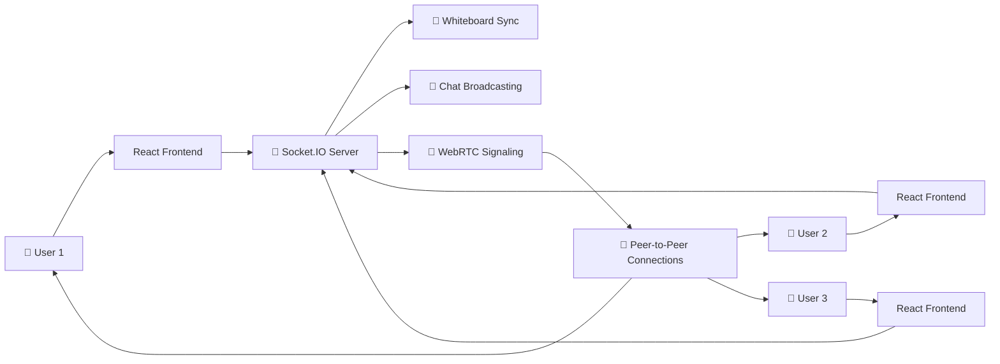

# 🚀 Nexivora

**Nexivora** is a modern all-in-one **virtual communication platform** designed for **teams, students, developers, and collaborative groups**.

It combines **multi-user video conferencing, real-time messaging, file sharing, and collaborative whiteboarding** into a single beautiful **SaaS-style application**.

## 🌐 Live Demo

🔗 **Live Application:** https://nexivora-lsot.onrender.com/

---

## 🚀 Features

### 🎥 Video Conferencing

* **Multi-user WebRTC peer-to-peer video calls**
* Camera and microphone controls
* **Screen sharing**
* Real-time participant management

### 💬 Real-time Chat

* **Instant messaging** inside meeting rooms
* Real-time message broadcasting using **Socket.IO**

### 🎨 Collaborative Whiteboard

* Real-time collaborative drawing
* **Draw and erase**
* Create **rectangles, circles, and lines**
* Synchronized drawing between participants

### 📁 File Sharing

* Upload files during meetings
* Download shared files
* Real-time file availability notifications

### 🔐 Secure Authentication

* **JWT-based authentication**
* Protected routes
* Secure user sessions

### 📊 Modern Dashboard

* View **recent meetings**
* Create new meeting rooms
* Join existing meetings
* Manage meeting activity

### 📱 Responsive Design

* Modern **dark-mode UI**
* **Glassmorphism** design elements
* Responsive layout for desktop, tablet, and mobile devices

---

## 🛠️ Technology Stack

### 🎨 Frontend

* **React 19**
* **TypeScript**
* **Vite**
* **Tailwind CSS 4**
* **Zustand**
* **React Router**
* **Socket.IO Client**
* **WebRTC**

### ⚙️ Backend

* **Node.js**
* **Express.js**
* **Socket.IO**
* **WebRTC Signaling**
* **Multer**

### 🗄️ Database

* **MongoDB**
* **Mongoose**

---

## 🏗️ Architecture



---

## 🔄 Real-time Communication Flow



---

## 📦 Project Setup

### ✅ Prerequisites

Make sure the following are installed:

* **Node.js v18 or higher**
* **MongoDB**
* **Git**
* **npm**

---

## 🗄️ 1. Database Setup

Make sure MongoDB is running locally on the default port:

```bash
27017
```

Alternatively, create a `.env` file inside the `backend` folder.

```env
PORT=5000
MONGO_URI=mongodb://127.0.0.1:27017/nexivora
JWT_SECRET=your_secure_jwt_secret_here
CLIENT_URL=http://localhost:5173
```

> ⚠️ For production, use a strong and secure `JWT_SECRET`.

---

## ⚙️ 2. Backend Setup

Open a terminal:

```bash
cd backend
npm install
npm run dev
```

The backend development server will start on:

```text
http://localhost:5000
```

---

## 🎨 3. Frontend Setup

Open another terminal:

```bash
cd frontend
npm install
npm run dev
```

The Vite development server will start on:

```text
http://localhost:5173
```

---

## 🚀 4. Running the Application

Once both **frontend and backend servers** are running:

1. Open **http://localhost:5173**
2. **Register** a new account
3. Login to your account
4. Open the **Dashboard**
5. Create a new meeting
6. Allow **Camera and Microphone** permissions
7. Share the **Meeting Room ID** with another user
8. Start collaborating

---

## 🧪 5. Testing Multi-user Functionality

To test **Video, Chat, Whiteboard, and File Sharing**:

### 👤 First User

1. Open the application in a normal browser window.
2. Register or login.
3. Create a meeting.
4. Copy the **Meeting Room ID**.

### 👤 Second User

1. Open an **Incognito / Private window** or another browser.
2. Register a second account.
3. Join the meeting using the **Meeting Room ID**.

You can now test:

* 🎥 **Video conferencing**
* 🎤 **Microphone**
* 🖥️ **Screen sharing**
* 💬 **Real-time chat**
* 🎨 **Collaborative whiteboard**
* 📁 **File sharing**

---

## 📁 Project Architecture

```text
Nexivora/
│
├── backend/
│   ├── src/
│   │   ├── sockets/
│   │   │   └── index.ts
│   │   ├── routes/
│   │   ├── controllers/
│   │   ├── models/
│   │   └── index.ts
│   │
│   ├── uploads/
│   ├── .env
│   └── package.json
│
├── frontend/
│   ├── src/
│   │   ├── components/
│   │   │   ├── Whiteboard.tsx
│   │   │   └── FileSharing.tsx
│   │   │
│   │   ├── hooks/
│   │   │   └── useWebRTC.ts
│   │   │
│   │   ├── pages/
│   │   ├── store/
│   │   └── App.tsx
│   │
│   ├── public/
│   └── package.json
│
└── README.md
```

---

## 🧩 Architecture Highlights

### 🔌 WebRTC Signaling

**`backend/src/sockets/index.ts`**

Handles:

* **WebRTC offers**
* **WebRTC answers**
* **ICE candidates**
* **Chat message broadcasting**
* **Whiteboard synchronization**

### 🎥 WebRTC Hook

**`frontend/src/hooks/useWebRTC.ts`**

A custom React hook responsible for managing:

* **RTCPeerConnection**
* Multiple participants
* Media streams
* Peer-to-peer connections
* Connection lifecycle

### 🎨 Collaborative Whiteboard

**`frontend/src/components/Whiteboard.tsx`**

Uses:

* **HTML5 Canvas API**
* **Socket.IO**
* Drawing tools
* Real-time synchronization

Supported tools include:

* ✏️ Draw
* 🧹 Erase
* ▭ Rectangle
* ◯ Circle
* ╱ Line

### 📁 File Sharing

**`frontend/src/components/FileSharing.tsx`**

Handles:

* File selection
* File uploads
* Backend communication
* Shared file notifications
* File downloads

The backend uses **Multer** for handling file uploads.

---

## 🔐 Security

Nexivora uses:

* **JWT Authentication**
* Protected routes
* Environment variables for secrets
* Server-side authentication
* Secure meeting access

> Never commit your production `.env` file or expose your `JWT_SECRET`.

---

## 💡 Core Technologies

| Technology       | Purpose                  |
| ---------------- | ------------------------ |
| **React**        | Frontend UI              |
| **TypeScript**   | Type-safe development    |
| **Vite**         | Frontend build tool      |
| **Tailwind CSS** | UI styling               |
| **Zustand**      | State management         |
| **Node.js**      | Backend runtime          |
| **Express.js**   | REST API                 |
| **Socket.IO**    | Real-time communication  |
| **WebRTC**       | Peer-to-peer video/audio |
| **MongoDB**      | Database                 |
| **Mongoose**     | MongoDB ODM              |
| **Multer**       | File uploads             |
| **JWT**          | Authentication           |

---

## 🌟 Why Nexivora?

Nexivora brings multiple collaboration features into **one unified platform**:

```text
🎥 Video Calls
      +
💬 Real-time Chat
      +
🎨 Collaborative Whiteboard
      +
📁 File Sharing
      +
🔐 Secure Authentication
      ↓
🚀 Nexivora
```

Instead of using separate tools for video meetings, messaging, whiteboarding, and file sharing, users can collaborate through a **single platform**.

---

## 🌐 Live Project

🚀 **Try Nexivora:**
https://nexivora-lsot.onrender.com/

---

## 👨‍💻 Built With

**React • TypeScript • Node.js • Express • MongoDB • Socket.IO • WebRTC • Tailwind CSS**

---

## ⭐ Support

If you find **Nexivora** useful, consider giving the repository a ⭐ on GitHub!

---

### 🚀 Enjoy collaborating with Nexivora!
